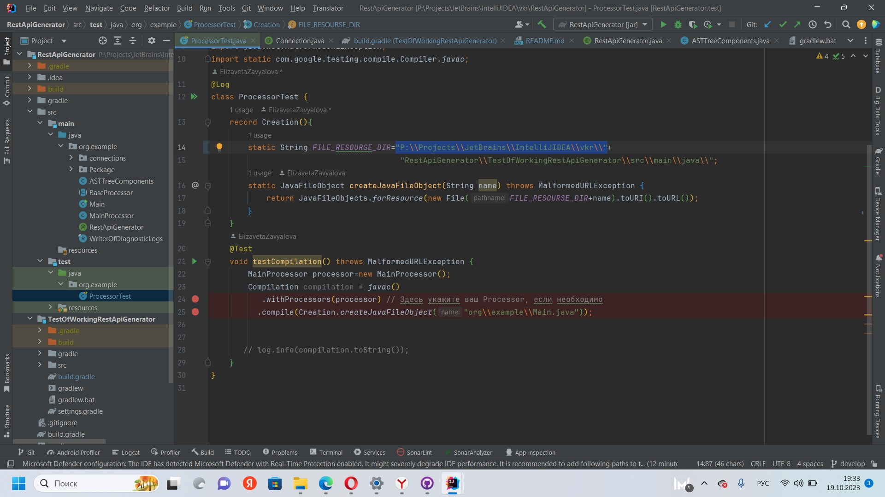

# Rest Api Generator

# Настройки:

Заменить в градл TectOfWorkingRestApiGenerator:

String restApiGeneratorProjectPath на путь к клонированному проекту.
А также выделенную строку на путь к клонированному проекту:
